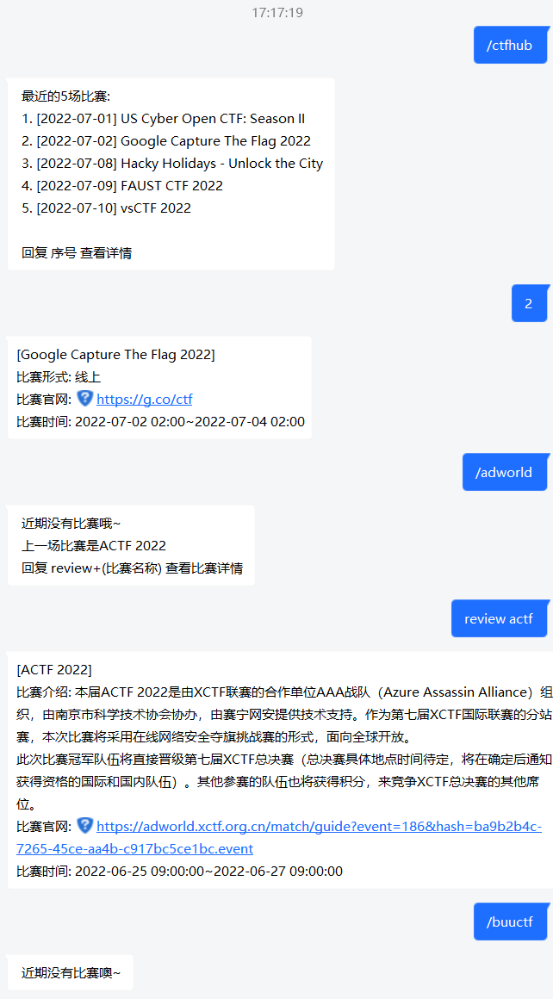

# nonebot_plugin_ctf_challenge_get
用于获取各CTF平台搜集的赛事信息，为了免去每一次搜集赛事信息都要进入各平台查看的烦恼

**代码写的很烂，仅供参考**

> ctfhub | adworld 直接调用平台接口
>
> buuctf 用爬虫解析
>
> 其他平台后续考虑陆续接入

## 使用方法

`default_start` 为命令起始符，这里以`/`为例。

```
{default_start}ctfhub  # 获取ctfhub平台搜集的赛事
{default_start}adworld  # 获取攻防世界平台搜集的赛事
{default_start}buuctf  # 获取BUUCTF搜集的赛事
```

